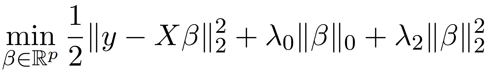

# L0BnB: Sparse Regression at Scale
### Hussein Hazimeh, Rahul Mazumder, and Ali Saab
### Massachusetts Institute of Technology

## Introduction
L0BnB is a scalable global optimization framework for solving linear regression problems penalized with a combination of the L0 and L2 norms. More concretely, given a data matrix X (with n samples and p features) and a response vector y, L0BnB solves the following problem to  optimality:



where the L0 norm counts the number of nonzeros in the coefficients vector B. Here the L0 norm performs variable selection, while the L2 norm adds shrinkage which can be effective in low-signal settings. L0BnB implements a custom branch-and-bound (BnB) framework that leverages a  highly specialized first-order method to solve the node subproblems. It achieves over 3600x speed-ups compared to the state-of-the-art mixed integer programming (MIP) solvers, and can scale to problems where p ~ 10^7. For more details, check out our paper *Sparse Regression at Scale: Branch-and-Bound rooted in First Order Optimization*.

The toolkit is implemented in Python, with critical code sections accelerated using Numba. See below for details on installation and usage.

## Installation
To install in Python 3, run the following command:
```bash
pip install L0BnB
```

## Usage
```python
import numpy as np
from l0bnb import fit_path
from l0bnb import gen_synthetic

"""
For demonstration, we first generate a synthetic regression dataset (X,y)
as follows: y = X*b + epsilon, where the true vector of coefficients b
is sparse and has only 10 nonzero indices.
We set the number of samples n=1000 and number of features p=10,000.
"""
X, y, b = gen_synthetic(n=1000, p=10000, supp_size=10)
print("Nonzero indices in b: ", np.nonzero(b)[0])

# Run L0BnB to solve the problem for a sequence of lambda_0's.
# By default, the sequence of lambda_0's is automatically chosen by the toolkit.
# Use max_nonzeros=10 to stop the regularization path at nonzeros.
# Note that we fix lambda_2 = 0.01.
sols = fit_path(X, y, lambda_2 = 0.01, max_nonzeros = 10)

# sols is a list of solutions.
# Below we inspect the 4th solution in the list.
sol = sols[4]
# The estimated coefficients vector b_estimated can be accessed as follows:
b_estimated = sol["B"]
# The intercept term is:
intercept = sol["B0"]
# Predictions on the training data can be made as follows:
y_estimated = np.dot(X, b_estimated) + intercept
# To check the nonzero indices in b_hat:
print("Nonzero indices in b_estimated: ", np.nonzero(b_estimated)[0])
# The nonzero indices in b_estimated match that of b.

# For more advanced usage, check the documentation of fit_path:
print(fit_path.__doc__)

```

## References
More details to be added soon.
